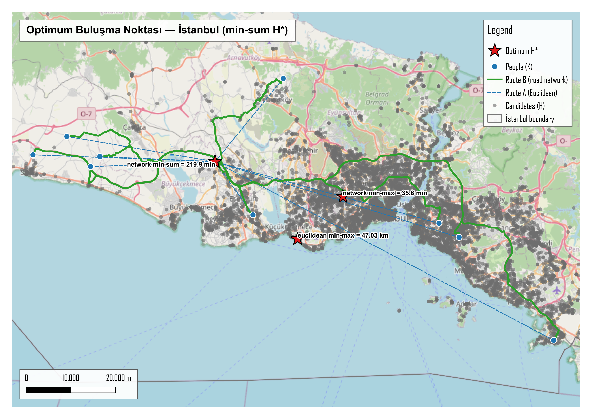
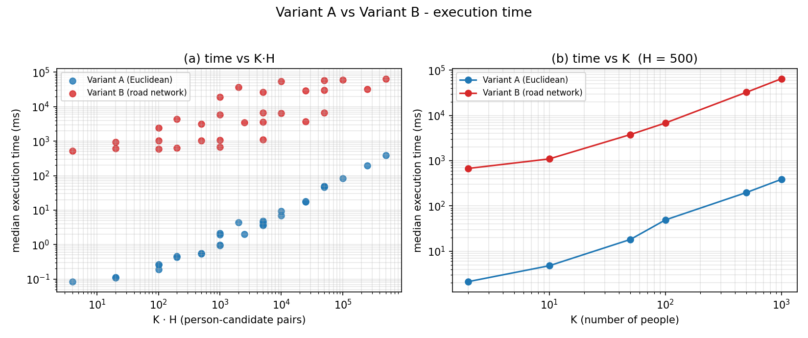
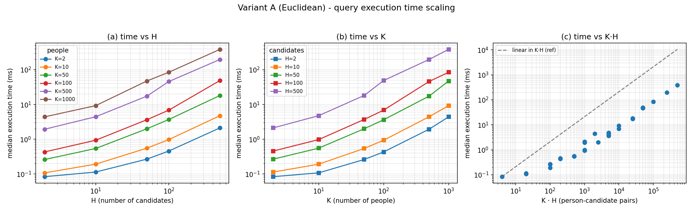

## 1. Problem Tanımı

İstanbul'da bir grup **K** kişinin buluşacağı en uygun tek hedefi, bilinen **H** aday noktalar
kümesi (restoranlar ve parklar) arasından seçmek amaçlanmıştır.

İki amaç fonksiyonu birlikte hesaplanmıştır:

- **Min-Sum:** Tüm kişilerin mesafe toplamını en aza indirip toplam yolculuğu küçültür.
- **Min-Max:** En uzaktaki kişinin mesafesini en aza indirir.

İki mesafe metriği (varyant) ayrı ayrı uygulanmıştır:

| Mesafe metriği                       | Motor                                     |
|--------------------------------------|-------------------------------------------|
| Kuş uçuşu / Öklid (düz çizgi)        | PostGIS `ST_Distance` (metre)             |
| Yol ağı en kısa yol (seyahat süresi) | pgRouting `pgr_dijkstraCost`, OSM yol ağı |

## 2. Veri ve Yöntem

**Veri kaynağı:** OpenStreetMap (İstanbul). Adaylar QuickOSM ile `amenity=restaurant` ve
`leisure=park` sorgularından, "In = İstanbul" alan filtresiyle çekilmiştir. Sınır poligonu
içinde kalanlar `ST_Within` ile seçilmiş ve her özellik `ST_PointOnSurface` ile tek bir
temsili iç noktaya indirgenmiştir → **5.369 restoran + 4.017 park = 9.386 aday**.
Yol verisi, Overpass API'den ham OSM XML olarak indirilip `osm2pgrouting` ile yönlü bir yol
ağına dönüştürülmüştür: **304.767 kenar, 209.818 düğüm** (kavşaklar düğüm, yol parçaları
kenardır). En kısa yol hesabında her yol parçasının ağırlığı olarak yol uzunluğu yerine
**seyahat süresi (saniye)** kullanılır ve tek yönlü caddeler yönlü aramada dikkate alınır.
**K = 10** kişi sınır içinde rastgele (seed = 42)
üretilmiştir. Ardından, bu noktalardan yalnızca **yol ağının birbirine bağlı en büyük parçasına
250 m'den yakın olanlar** tutulmuştur. Bu eleme yapılmazsa, il alanının büyük kısmındaki (deniz,
orman, kırsal) ve yalnız feribotla ulaşılan Adalar gibi kopuk parçalardaki kişiler yol ağı
üzerinden hiçbir hedefe ulaşamazdı.

**Öklid varyantı:** Geometriler EPSG:32635'e (UTM 35N, metre) bir kez dönüştürülür.
`persons` ve `candidates` tabloları çapraz birleştirilerek (CROSS JOIN) her kişi-aday çifti için
`ST_Distance` hesaplanır. Mesafeler aday başına `SUM` ve `MAX` ile toplanıp min-sum ve min-max
amaçlarına göre ayrı ayrı sıralanır.

**Yol ağı varyantı:** Her kişi ve aday, en yakın ağ düğümüne eşlenir. Eşleme için önce
indeksli en yakın komşu araması (`<->`) ile yaklaşık en yakın birkaç düğüm hızlıca getirilir,
ardından bunlar gerçek metrik mesafeye göre yeniden sıralanıp en yakın olan seçilir.
Tek bir `pgr_dijkstraCost(...)` çağrısı,
her kişiden her adaya giden en kısa yolun **seyahat süresini (saniye)** içeren K×H matrisini
üretir ve bu süreler aday başına toplanır. `HAVING count(DISTINCT person_id) = K` koşulu, her
kişinin yolla ulaşamadığı adayları eler.

## 3. Sonuçlar

İki varyantın da **min-sum** kazananı **aynı merkezî park** (aday id 9102) çıkmıştır. Bu sonuç,
şehrin coğrafi/ağ merkezindeki bir noktanın toplam yolculuğu her iki metrikte de en aza
indirdiğini gösterir. **Min-max** kazananı ise farklıdır. En uzaktaki kişinin mesafesini en aza
indirmek, merkezden bir miktar uzaktaki bir noktayı seçer. Aşağıda yol ağı varyantı için ilk
sıralar verilmiştir:

| Aday                   | Kategori | Toplam (dk) | Maks (dk) | min-sum sıra | min-max sıra |
|------------------------|----------|------------:|----------:|-------------:|-------------:|
| 9102 (park)            | park     |   **219.9** |      48.2 |        **1** |         5231 |
| 9016 Mimar Sinan Parkı | park     |       221.0 |      47.5 |            2 |         5147 |
| 8109 (park)            | park     |       252.5 |  **35.6** |         1070 |        **1** |

> **Min-sum optimumu** (her iki varyant): park id 9102 — ağ üzerinde toplam **219,9 dk**.
> **Min-max optimumu** (yol ağı): park id 8109 — en kötü birey **35,6 dk** (toplamı daha yüksek,
> 252,5 dk — adalet için toplam verimlilik azalır). Öklid min-max optimumunda en kötü
> birey 47,03 km'dir.

{width=92%}

## 4. Doğrulama

Her iki varyant, elle doğrulanabilir küçük kümelerde (2 kişi, 3 hedef) sınanmıştır.
Öklid kümesinde koordinatlar doğrudan metre cinsinden verilip mesafeler Pisagor ile elle
hesaplanabilir. Yol ağı varyantında ise merkezî bir düğüm üzerinden geçen küçük bir test ağı
kurulmuştur.
Her iki testte de orta hedef **H2 hem min-sum hem min-max'ta 1. sıradadır**. Ağ testinde, tek
yönlü bir kenarın arkasındaki **H4** hiçbir kişiden erişilemediği için `HAVING` ile doğru
biçimde elenir — yani erişilebilirlik filtresi çalışır.

| Test         | Hedef   |     Toplam |      Maks | min-sum | min-max |
|--------------|---------|-----------:|----------:|--------:|--------:|
| Öklid (m)    | **H2**  | **12.806** | **6.403** |   **1** |   **1** |
| Öklid (m)    | H1 / H3 |     14.770 |    10.770 |       2 |       2 |
| Yol ağı (sn) | **H2**  |    **300** |   **150** |   **1** |   **1** |
| Yol ağı (sn) | H1 / H3 |        500 |       250 |       2 |       2 |
| Yol ağı (sn) | H4      |          — |         — |  elendi |  elendi |

## 5. Performans

`benchmark.py`, K = {2, 10, 50, 100, 500, 1000} ile H = {2, 10, 50, 100, 500} ızgarasında her
hücreyi önce bir kez ön çalıştırır (sonucu atılır), ardından 5 kez ölçerek sunucu tarafındaki
`EXPLAIN (ANALYZE)` süresinin medyanını alır.

|             | K=2, H=2 | K=10, H=10 | K=100, H=100 | K=1000, H=500 |
|-------------|---------:|-----------:|-------------:|--------------:|
| **Öklid**   |  0,08 ms |    0,19 ms |       6,9 ms |        386 ms |
| **Yol ağı** |   530 ms |   1.021 ms |     6.424 ms |     64.685 ms |

{width=86%}

- **Öklid varyantı**, `O(K·H)` karmaşıklığında bir mesafe hesabıdır. K·H ile yaklaşık
  **doğrusal** artar ve tüm ızgara boyunca **saniyenin altında** kalır.
- **Yol ağı varyantı**, K tarafından belirlenir: `pgr_dijkstraCost` her kişi için ağ üzerinde tek
  kaynaktan tüm hedeflere giden bir Dijkstra araması çalıştırır. Bu nedenle çalışma süresi K ile
  yaklaşık doğrusal büyürken **aday sayısını artırmanın etkisi çok azdır**. Yol ağı varyantı, aynı
  (K, H) için Öklid varyantından **~10²–10⁴ kat** yavaştır. Bu fark, yol ağı üzerinden gerçekçi
  hesaplamanın getirdiği ek hesaplama yüküdür.

{width=100%}

{width=100%}

## 6. Tartışma ve Sonuç

- **Öklid ↔ yol ağı:** Min-sum'da iki varyant aynı noktayı seçti. Bu durum, merkezî bir adayın iki
  metrikte de en iyi sonucu verdiğini gösterir. Genel olarak Öklid mesafesi köprü, su ve
  tek yön gibi kısıtları hesaba katmaz. Bu nedenle Öklid varyantı daha hızlı ama yaklaşık bir
  sonuç verir, yol ağı varyantı ise hesaplama maliyeti yüksek ama gerçekçidir.
- **Min-sum ↔ min-max:** Min-sum toplam mesafeyi, min-max en uzaktaki bireyin mesafesini önceler
  ve farklı aday seçebilir. Hangisinin tercih edileceği, toplam yolun mu yoksa en uzaktaki bireyin
  mesafesinin mi öncelikli olduğuna bağlıdır.

**Sonuç:** Hem Öklid (kuş uçuşu) hem yol ağına dayalı optimum buluşma noktası tamamen SQL
içinde, iki amaç fonksiyonuyla, doğrulanmış ve ölçeklenmesi grafiklenmiş biçimde hesaplanmıştır.
İstanbul verisinde her iki varyantın min-sum cevabı, merkezî bir parkta (id 9102)
buluşmaktır.
